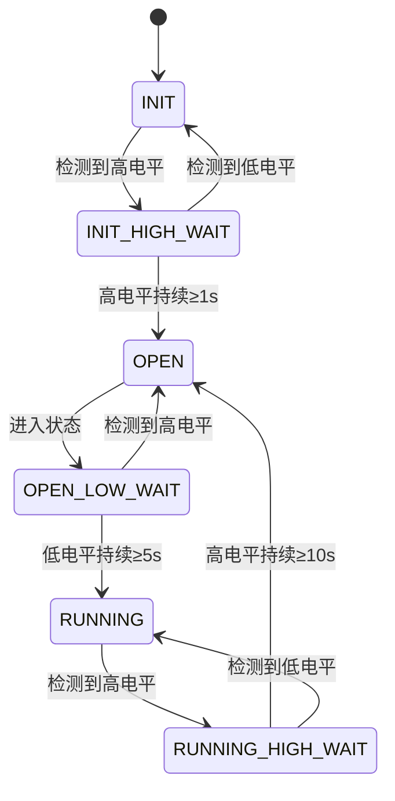

# 注水阀控制功能设计方案

## 1. 文档信息

| 项目 | 内容 |
|------|------|
| 文档标题 | 注水阀控制功能详细设计方案 |
| 版本号 | V1.0.0 |
| 日期 | 2026-05-08 |
| 状态 | 待审查 |
| 作者 | AI Assistant |

## 2. 背景与目标

### 2.1 项目背景

本项目为制冷电源控制板固件（REFpowerControl_V1），基于雅特力AT32F403A407微控制器开发。系统已实现以下功能模块：

- 多路传感器输入检测（SENSOR_IN_1/2/3）
- 液位/流量联锁控制
- PID温度控制
- 设备开关控制（制冷、风扇、水泵、阀门）
- 触摸按键输入
- 数码管显示

### 2.2 功能需求

**上电初始化阶段：**

- 系统上电后立即开始检测SER_IN_1信号
- 当检测到SER_IN_1持续1秒及以上的高电平时，立即将SW_VALVE_1拉高，实现注水阀打开
- 打开后持续监测SER_IN_1，当检测到其持续5秒的低电平时，将SW_VALVE_1拉低，实现注水阀关闭

**系统运行阶段：**

- 持续监测SER_IN_1信号状态
- 当检测到SER_IN_1持续10秒及以上的高电平时，立即将SW_VALVE_1拉高，实现注水阀打开
- 打开后持续监测SER_IN_1，当检测到其持续5秒的低电平时，将SW_VALVE_1拉低，实现注水阀关闭

### 2.3 设计约束

- **信号源**：使用SER_IN_1信号，与现有液位检测复用同一GPIO
- **阀门位置**：设备入水口
- **独立性**：注水阀控制逻辑完全独立于现有液位联锁（FluidInterlock）运行
- **检测精度**：1ms级别（使用TMR4定时器）
- **阀门控制**：使用SW_VALVE_1 GPIO输出

## 3. 系统架构设计

### 3.1 现有系统资源

| 资源类型 | 资源名称 | 配置 | 用途 |
|---------|---------|------|------|
| 定时器 | TMR4 | 1ms周期中断 | 传感器扫描、触摸按键扫描 |
| GPIO输入 | SER_IN_1 | GPIOD Pin12 | 液位检测信号 |
| GPIO输出 | SW_VALVE_1 | GPIOD Pin15 | 注水阀控制 |
| 现有模块 | SensorInput | DEBOUNCE_TIME_MS=50ms | 传感器消抖处理 |
| 现有模块 | FluidInterlock | 1s检测周期 | 液位联锁控制 |

### 3.2 定时器配置参数

| 参数 | 配置值 | 说明 |
|------|--------|------|
| TMR4_DIV | 23 | 时钟分频 |
| TMR4_PR | 9999 | 自动重装载值 |
| TMR4周期 | 1ms | 定时器频率：120MHz / (23+1) / (9999+1) = 1kHz |
| 每秒滴答数 | 1000 | 1ms × 1000 = 1s |

### 3.3 新增模块架构

```
┌─────────────────────────────────────────────┐
│              TMR4 中断 (1ms)                  │
│  ┌─────────────┐  ┌─────────────────────┐  │
│  │ SensorInput │  │ ValveControl (新增)  │  │
│  │   _Scan()   │  │   _Tmr4Tick()       │  │
│  └─────────────┘  └─────────────────────┘  │
└─────────────────────────────────────────────┘
                    │
                    ▼
        ┌───────────────────────┐
        │   SER_IN_1 GPIO输入   │
        └───────────────────────┘
                    │
                    ▼
        ┌───────────────────────┐
        │   状态机处理逻辑       │
        │   (6个状态)           │
        └───────────────────────┘
                    │
                    ▼
        ┌───────────────────────┐
        │   SW_VALVE_1输出     │
        │   GPIOD Pin15        │
        └───────────────────────┘
```

## 4. 状态机设计

### 4.1 状态定义

| 状态枚举 | 状态名称 | 状态说明 | 阀门输出 |
|---------|---------|---------|----------|
| VALVE_STATE_INIT | 初始化状态 | 上电后等待阶段，监测SER_IN_1信号 | 保持关闭 |
| VALVE_STATE_INIT_HIGH_WAIT | 初始化高电平等待 | 等待高电平持续≥1秒 | 保持关闭 |
| VALVE_STATE_OPEN | 阀门打开状态 | 阀门已打开，等待低电平信号 | SW_VALVE_1拉低（开启） |
| VALVE_STATE_OPEN_LOW_WAIT | 打开后低电平等待 | 等待低电平持续≥5秒后关闭 | 保持开启 |
| VALVE_STATE_RUNNING | 运行状态 | 系统运行阶段，监测高电平信号 | 保持关闭 |
| VALVE_STATE_RUNNING_HIGH_WAIT | 运行高电平等待 | 等待高电平持续≥10秒 | 保持关闭 |

### 4.2 状态转换表

| 当前状态 | 触发条件 | 下一状态 | 动作 |
|---------|---------|---------|------|
| INIT | 检测到高电平 | INIT_HIGH_WAIT | 重置高电平计数器 |
| INIT | 检测到低电平 | INIT | 重置计数器，继续等待 |
| INIT_HIGH_WAIT | 高电平持续≥1000ms | OPEN | 打开阀门，记录时间 |
| INIT_HIGH_WAIT | 检测到低电平 | INIT | 重置计数器 |
| OPEN | 进入状态 | OPEN_LOW_WAIT | 重置低电平计数器 |
| OPEN_LOW_WAIT | 低电平持续≥5000ms | RUNNING | 关闭阀门 |
| OPEN_LOW_WAIT | 检测到高电平 | OPEN | 重置计数器，继续保持开启 |
| RUNNING | 检测到高电平 | RUNNING_HIGH_WAIT | 重置高电平计数器 |
| RUNNING | 检测到低电平 | RUNNING | 重置计数器 |
| RUNNING_HIGH_WAIT | 高电平持续≥10000ms | OPEN | 打开阀门，记录时间 |
| RUNNING_HIGH_WAIT | 检测到低电平 | RUNNING | 重置计数器 |

### 4.3 状态转换图



## 5. 时序逻辑设计

### 5.1 信号检测机制

**双重检测策略：**

1. **软件消抖**：通过时间持续判断，避免信号抖动误触发
   - 高电平需持续指定时间阈值才确认
   - 低电平需持续指定时间阈值才确认
2. **边缘检测**：每次状态变化立即响应
   - 从低到高：启动高电平计数器
   - 从高到低：启动低电平计数器
3. **计数器机制**：
   - 每次TMR4中断（1ms），根据当前GPIO电平状态更新对应计数器
   - 计数器达到阈值时触发状态转换

### 5.2 时间阈值配置

| 参数名 | 配置值 | 单位 | 说明 |
|--------|--------|------|------|
| VALVE_TICKS_PER_SEC | 1000 | ticks/s | 每秒定时器滴答数 |
| VALVE_INIT_HIGH_TIME | 1000 | ms | 上电初始化高电平持续时间 |
| VALVE_OPEN_LOW_TIME | 5000 | ms | 阀门打开后低电平持续关闭时间 |
| VALVE_RUNNING_HIGH_TIME | 10000 | ms | 运行阶段高电平持续开启时间 |

### 5.3 定时器中断处理流程

```
TMR4 中断 (1ms周期)
  │
  ├─ 清除中断标志
  │
  ├─ 读取SER_IN_1 GPIO状态 (ser_in1_level)
  │
  ├─ 根据当前状态执行处理:
  │   │
  │   ├─ INIT:
  │   │   ├─ if (ser_in1_level == HIGH):
  │   │   │   └─ high_counter = 1, 转换到INIT_HIGH_WAIT
  │   │   └─ else:
  │   │       └─ low_counter++, high_counter = 0
  │   │
  │   ├─ INIT_HIGH_WAIT:
  │   │   ├─ if (ser_in1_level == HIGH):
  │   │   │   ├─ high_counter++
  │   │   │   └─ if (high_counter >= 1000):
  │   │   │       ├─ 打开阀门 (SW_VALVE_1 = LOW)
  │   │   │       └─ 转换到OPEN
  │   │   └─ else:
  │   │       ├─ low_counter++
  │   │       └─ if (low_counter >= 1): 转换到INIT
  │   │
  │   ├─ OPEN:
  │   │   └─ 重置计数器, 转换到OPEN_LOW_WAIT
  │   │
  │   ├─ OPEN_LOW_WAIT:
  │   │   ├─ if (ser_in1_level == LOW):
  │   │   │   ├─ low_counter++
  │   │   │   └─ if (low_counter >= 5000):
  │   │   │       ├─ 关闭阀门 (SW_VALVE_1 = HIGH)
  │   │   │       └─ 转换到RUNNING
  │   │   └─ else:
  │   │       ├─ high_counter++
  │   │       └─ if (high_counter >= 1): 转换到OPEN
  │   │
  │   ├─ RUNNING:
  │   │   ├─ if (ser_in1_level == HIGH):
  │   │   │   └─ 转换到RUNNING_HIGH_WAIT
  │   │   └─ else:
  │   │       └─ 重置计数器
  │   │
  │   └─ RUNNING_HIGH_WAIT:
  │       ├─ if (ser_in1_level == HIGH):
  │       │   ├─ high_counter++
  │       │   └─ if (high_counter >= 10000):
  │       │       ├─ 打开阀门 (SW_VALVE_1 = LOW)
  │       │       └─ 转换到OPEN
  │       └─ else:
  │           └─ 转换到RUNNING
  │
  └─ 退出中断
```

## 6. 数据结构设计

### 6.1 阀门控制状态结构体

```c
/**
 * @brief 阀门控制状态结构体
 */
typedef struct {
    valve_state_t state;              /**< 当前状态机状态 */
    uint32_t high_streak_counter;    /**< 高电平持续计数器 (单位: ms) */
    uint32_t low_streak_counter;     /**< 低电平持续计数器 (单位: ms) */
    uint32_t ticks_per_sec;          /**< 每秒定时器滴答数 */
    uint8_t valve_open;             /**< 阀门实际状态标志: 0=关闭, 1=打开 */
} valve_control_status_t;
```

### 6.2 全局变量声明

```c
/**
 * @brief 阀门控制全局状态变量
 * @note  在 valve_control.c 中定义，外部文件通过 extern 声明使用
 */
extern valve_control_status_t g_valve_control_status;
```

### 6.3 配置参数定义

```c
#ifndef __VALVE_CONTROL_H
#define __VALVE_CONTROL_H

#ifdef __cplusplus
extern "C" {
#endif

#include "at32f403a_407.h"

/** 定时器配置 - 与TMR4保持一致 */
#define VALVE_TMR4_DIV                 23u
#define VALVE_TMR4_PR                 9999u

/** 时间阈值配置 (单位: ms) */
#define VALVE_INIT_HIGH_TIME_MS       1000u   /**< 上电初始化: 高电平持续1s */
#define VALVE_OPEN_LOW_TIME_MS         5000u  /**< 打开后: 低电平持续5s关闭 */
#define VALVE_RUNNING_HIGH_TIME_MS    10000u  /**< 运行阶段: 高电平持续10s开启 */

/** 备用定时周期 (fallback) */
#define VALVE_FALLBACK_TICKS_PER_SEC   1000u

/** 阀门GPIO定义 - 与 at32f403a_407_wk_config.h 保持一致 */
#define SW_VALVE_1_PIN                GPIO_PINS_15
#define SW_VALVE_1_GPIO_PORT          GPIOD
#define SER_IN_1_PIN                  GPIO_PINS_12
#define SER_IN_1_GPIO_PORT            GPIOD

/** 阀门状态枚举 */
typedef enum {
    VALVE_STATE_INIT = 0,            /**< 初始化状态 */
    VALVE_STATE_INIT_HIGH_WAIT,      /**< 初始化高电平等待 */
    VALVE_STATE_OPEN,                /**< 阀门打开状态 */
    VALVE_STATE_OPEN_LOW_WAIT,       /**< 打开后低电平等待 */
    VALVE_STATE_RUNNING,             /**< 运行状态 */
    VALVE_STATE_RUNNING_HIGH_WAIT    /**< 运行高电平等待 */
} valve_state_t;

/** 阀门状态结构体 */
typedef struct {
    valve_state_t state;             /**< 当前状态机状态 */
    uint32_t high_streak_counter;    /**< 高电平持续计数器 (ms) */
    uint32_t low_streak_counter;     /**< 低电平持续计数器 (ms) */
    uint32_t ticks_per_sec;          /**< 每秒定时器滴答数 */
    uint8_t valve_open;             /**< 阀门实际状态: 0=关闭, 1=打开 */
} valve_control_status_t;

/** 全局变量声明 */
extern valve_control_status_t g_valve_control_status;

/** 公共函数接口 */
void ValveControl_Init(void);
void ValveControl_Tmr4Tick(void);
valve_state_t ValveControl_GetState(void);
uint8_t ValveControl_IsValveOpen(void);
void ValveControl_ForceClose(void);
valve_control_status_t* ValveControl_GetStatus(void);

#ifdef __cplusplus
}
#endif

#endif /* __VALVE_CONTROL_H */
```

## 7. 函数接口设计

### 7.1 公共接口说明

| 函数名 | 原型 | 功能描述 |
|--------|------|---------|
| ValveControl_Init | `void ValveControl_Init(void)` | 阀门控制模块初始化 |
| ValveControl_Tmr4Tick | `void ValveControl_Tmr4Tick(void)` | TMR4定时器中断回调 (1ms) |
| ValveControl_GetState | `valve_state_t ValveControl_GetState(void)` | 获取当前阀门状态机状态 |
| ValveControl_IsValveOpen | `uint8_t ValveControl_IsValveOpen(void)` | 查询阀门是否已打开 |
| ValveControl_ForceClose | `void ValveControl_ForceClose(void)` | 强制关闭阀门 (异常处理用) |
| ValveControl_GetStatus | `valve_control_status_t* ValveControl_GetStatus(void)` | 获取完整状态结构体指针 |

### 7.2 内部函数说明

| 函数名 | 原型 | 功能描述 |
|--------|------|---------|
| valve_read_ser_in1 | `static uint8_t valve_read_ser_in1(void)` | 读取SER_IN_1 GPIO状态 |
| valve_set_output | `static void valve_set_output(uint8_t state)` | 设置SW_VALVE_1输出 |
| valve_open | `static void valve_open(void)` | 执行阀门打开动作 |
| valve_close | `static void valve_close(void)` | 执行阀门关闭动作 |
| valve_state_init_handler | `static void valve_state_init_handler(uint8_t ser_level)` | INIT状态处理 |
| valve_state_init_high_wait_handler | `static void valve_state_init_high_wait_handler(uint8_t ser_level)` | INIT_HIGH_WAIT状态处理 |
| valve_state_open_handler | `static void valve_state_open_handler(void)` | OPEN状态处理 |
| valve_state_open_low_wait_handler | `static void valve_state_open_low_wait_handler(uint8_t ser_level)` | OPEN_LOW_WAIT状态处理 |
| valve_state_running_handler | `static void valve_state_running_handler(uint8_t ser_level)` | RUNNING状态处理 |
| valve_state_running_high_wait_handler | `static void valve_state_running_high_wait_handler(uint8_t ser_level)` | RUNNING_HIGH_WAIT状态处理 |

## 8. 异常处理设计

### 8.1 信号异常处理策略

| 异常类型 | 检测条件 | 处理策略 | 恢复机制 |
|---------|---------|---------|---------|
| 信号抖动 | 短时间内频繁跳变 | 使用时间阈值判断，避免误触发 | 自动恢复 |
| 信号线断路 | 持续高电平≥10s | 按需求打开阀门 (安全模式) | 人工修复后重新上电 |
| 信号线短路 | 持续低电平 | 保持阀门关闭状态 | 人工修复后重新上电 |
| 突发掉电 | 系统复位 | 阀门恢复默认关闭状态 | 上电后重新初始化 |

### 8.2 状态机保护机制

1. **超时保护**：每个等待状态设置最大等待时间，防止状态机卡死
2. **计数器溢出保护**：使用32位计数器，避免溢出
3. **非法状态检测**：检测到异常状态时强制恢复到INIT状态
4. **看门狗**：启用IWDG，防止程序死锁 (系统级保护)

### 8.3 异常处理函数

```c
/**
 * @brief 强制关闭阀门
 * @note  用于异常情况下的紧急关闭
 */
void ValveControl_ForceClose(void)
{
    g_valve_control_status.state = VALVE_STATE_INIT;
    g_valve_control_status.high_streak_counter = 0;
    g_valve_control_status.low_streak_counter = 0;
    g_valve_control_status.valve_open = 0;
    valve_close();
}
```

## 9. 与现有模块集成

### 9.1 TMR4中断集成

**文件：at32f403a_407_int.c**

```c
/**
 * @brief TMR4中断服务程序
 */
void TMR4_GLOBAL_IRQHandler(void)
{
    if(tmr_interrupt_flag_get(TMR4, TMR_OVF_FLAG) != RESET)
    {
        tmr_flag_clear(TMR4, TMR_OVF_FLAG);
        
        TouchKey_Scan();          // 触摸按键扫描
        SensorInput_Scan();       // 传感器扫描
        ValveControl_Tmr4Tick(); // 阀门控制 (新增)
    }
}
```

### 9.2 main.c初始化

**文件：main.c**

```c
int main(void)
{
    /* 系统和外围初始化 */
    wk_system_clock_config();
    wk_periph_clock_config();
    wk_debug_config();
    wk_nvic_config();
    wk_timebase_init();
    wk_gpio_config();
    wk_dma1_channel1_init();
    wk_dma1_channel2_init();
    dma_channel_enable(DMA1_CHANNEL1, TRUE);
    dma_channel_enable(DMA1_CHANNEL2, TRUE);
    wk_usart1_init();
    wk_tmr1_init();
    wk_tmr2_init();
    wk_tmr3_init();
    wk_tmr4_init();  // TMR4初始化
    
    /* 用户模块初始化 */
    GlobalSensorData_Init();
    DeviceControl_Init();
    SensorInput_Init();
    FluidInterlock_Init();
    ValveControl_Init();  // 新增: 阀门控制初始化
    
    TouchKey_Init();
    DigitTube_Init();
    PID_Init(&pid_controller);
    
    /* DS18B20初始化 */
    ds_list[DSB1] = &DSTemp[DSB1];
    ds_list[DSB2] = &DSTemp[DSB2];
    DS18B20_Init(ds_list);
    
    PID_Enable(&pid_controller);
    DigitTube_SetLEDState(1, 1);
    DigitTube_SetLEDState(2, 0);
    BEEP_Control(1000, 1);
    
    while(1)
    {
        TouchKey_EventProcess();
        
        if (g_scan_counter >= 10000)
        {
            g_scan_counter = 0;
            FluidInterlock_MainLoopProcess();
            DS18B20_UpdateAllTemp(ds_list);
            current_temp = DS18B20_GetValidTemp();
            
            PID_Compute(&pid_controller, current_temp,
                        FluidInterlock_IsWpump1Allowed(),
                        FluidInterlock_IsSer2Valid());
            
            DigitTube_DisplayTemp(DS18B20_GetValidDisplayValue(), 
                                  DigitTube_GetUnit());
        }
    }
}
```

## 10. 文件结构

### 10.1 新增文件清单

| 文件路径 | 文件类型 | 功能描述 |
|---------|---------|---------|
| ucode/valve_control.h | 头文件 | 阀门控制模块头文件 |
| ucode/valve_control.c | 源文件 | 阀门控制模块实现 |

### 10.2 修改文件清单

| 文件路径 | 修改内容 |
|---------|---------|
| ucode/ucode.uvprojx | 添加valve_control.c到工程 |
| project/src/at32f403a_407_int.c | 添加ValveControl_Tmr4Tick调用 |
| project/src/main.c | 添加ValveControl_Init调用 |

## 11. 测试计划

### 11.1 单元测试

| 测试项 | 测试方法 | 预期结果 |
|--------|---------|---------|
| 状态转换测试 | 模拟SER_IN_1信号，观察状态转换 | 符合状态转换表 |
| 定时精度测试 | 测量实际定时周期 | 误差<1% |
| 边界条件测试 | 正好1s、5s、10s触发点 | 正确触发 |
| 计数器清零测试 | 状态转换时计数器正确清零 | 计数器归零 |

### 11.2 集成测试

| 测试项 | 测试方法 | 预期结果 |
|--------|---------|---------|
| TMR4中断负载测试 | 同时运行多个模块，测量中断响应时间 | <100μs |
| 与SensorInput共存测试 | 验证信号读取不受影响 | 正常工作 |
| 长时间稳定性测试 | 连续运行24小时 | 无异常 |

### 11.3 异常测试

| 测试项 | 测试方法 | 预期结果 |
|--------|---------|---------|
| 信号快速切换测试 | 模拟100ms周期信号跳变 | 无误触发 |
| 断电重启测试 | 模拟突然断电 | 阀门关闭，系统正常重启 |
| 看门狗复位测试 | 触发看门狗复位 | 系统恢复正常 |

## 12. 实现要点

### 12.1 GPIO操作注意事项

- SER_IN_1为输入GPIO，无需配置上拉/下拉
- SW_VALVE_1为输出GPIO，配置为推挽输出
- 阀门控制GPIO极性：低电平开启，高电平关闭 (与device_control模块一致)

### 12.2 定时器配置注意事项

- TMR4由APB1时钟驱动 (120MHz)
- 定时器参数已与TMR4初始化保持一致
- 不需要额外初始化TMR4，复用现有配置

### 12.3 状态机实现要点

- 使用switch-case结构实现状态分发
- 每个状态的处理函数接收当前GPIO电平作为参数
- 状态转换和动作执行在同一次中断中完成

## 13. 附录

### 13.1 术语表

| 术语 | 说明 |
|------|------|
| SER_IN_1 | 传感器输入1，用于液位检测信号 |
| SW_VALVE_1 | 阀门1开关控制输出 |
| TMR4 | 通用定时器4，用于1ms周期中断 |
| 状态机 | State Machine，用于描述系统状态转换逻辑 |

### 13.2 参考文档

| 文档名称 | 说明 |
|---------|------|
| AT32F403A407数据手册 | 微控制器技术规格 |
| AT32F403A407参考手册 | 外设配置详解 |
| 项目引脚定义文档 | GPIO引脚分配 |
| sensor_input.c | 现有传感器输入模块实现参考 |
| fluid_flow_interlock.c | 现有联锁控制模块实现参考 |

---

**文档版本历史：**

| 版本 | 日期 | 修改内容 | 作者 |
|------|------|---------|------|
| V1.0.0 | 2026-05-08 | 初始版本 | AI Assistant |

---

**审查记录：**

| 审查日期 | 审查人 | 审查意见 | 状态 |
|---------|-------|---------|------|
| - | - | - | 待审查 |
